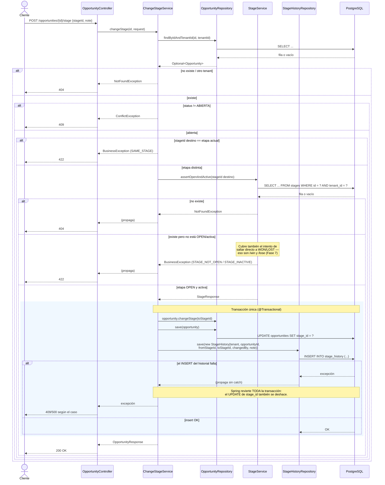

# Secuencia: cambio de etapa (BE-OPP-05)

Ilustra por qué el cambio de etapa no es un `PUT` genérico: coordina dos escrituras
(`Opportunity` y `StageHistory`) en una única transacción, con reglas de negocio antes
de tocar la base.

