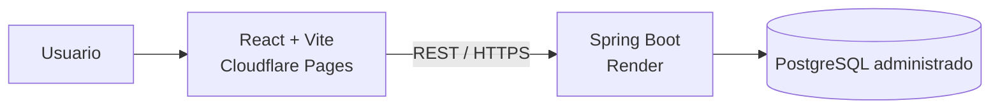

# Arquitectura general

## Objetivo y enfoque

zTech CRM se implementa como un **monolito modular** en un monorepo. La solución mantiene una aplicación web, una API y una base de datos, con límites internos por capacidad de negocio. Este enfoque reduce el costo operativo del trabajo práctico sin renunciar a separación de responsabilidades, pruebas aisladas y evolución futura.

## Stack aprobado

| Área | Tecnología |
|---|---|
| Frontend | React, TypeScript y Vite |
| Backend | Java y Spring Boot |
| Seguridad | Spring Security y JWT |
| Persistencia | PostgreSQL, Spring Data JPA, Hibernate y Flyway |
| Pruebas | JUnit, Spring Boot Test, Testcontainers, Vitest, Testing Library y Playwright |
| Hosting | Cloudflare Pages (frontend), Render (backend) y PostgreSQL administrado |
| Empaquetado backend | Docker |

React Router, TanStack Query, React Hook Form y Zod son las bibliotecas previstas para el frontend. Redux no se incorpora salvo que aparezca una necesidad concreta.

## Vista de contenedores



El navegador nunca accede a PostgreSQL. El backend es el único punto para autenticar, resolver el tenant, autorizar, ejecutar reglas de negocio, coordinar transacciones y persistir.

## Organización del monorepo

```text
ztech-crm/
├── frontend/
├── backend/
├── docs/
├── infra/
└── .github/
```

`frontend/` y `backend/` son proyectos independientes. `infra/` contiene artefactos de despliegue, como el `Dockerfile`; `.github/` contiene automatización de integración. No se requieren Nx, Turborepo ni un orquestador de monorepo inicialmente.

## Contrato e integración

La API usa JSON sobre HTTPS y rutas versionadas bajo `/api/v1`. Los controladores reciben y devuelven DTOs; nunca exponen entidades JPA. Ejemplos:

```text
POST /api/v1/auth/login
GET  /api/v1/companies
POST /api/v1/opportunities
POST /api/v1/opportunities/{id}/stage
POST /api/v1/opportunities/{id}/win
```

Los errores deben ser consistentes y no revelar datos de otro tenant. Un conflicto de disponibilidad se representa como `409 Conflict`; errores de validación y autorización deben distinguirse mediante códigos HTTP apropiados.

## Despliegue y operación

El frontend se compila como SPA y se publica en Cloudflare Pages. El backend se construye como imagen Docker y se despliega en Render. Para el TP puede utilizarse Neon como PostgreSQL administrado; una evolución SaaS puede ubicar la base en Render.

Spring Boot Actuator expone al menos `/actuator/health`. Los logs incluyen `requestId`, `userId` y `tenantId`, sin credenciales ni datos sensibles. La configuración se suministra por variables de entorno; ningún secreto se versiona.

## Fuera de la arquitectura inicial

No se incorporan microservicios, Kafka, RabbitMQ, Redis, Kubernetes, Elasticsearch, GraphQL, CQRS, Event Sourcing ni API Gateway. Cualquier incorporación futura requiere una necesidad medible y una decisión de arquitectura registrada.
