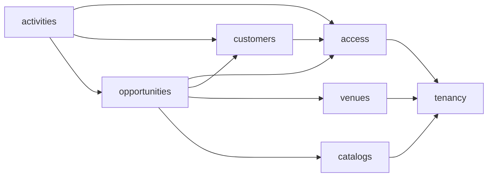

# Módulos y capas

## Límites del backend

El backend se divide por capacidades de negocio:

| Módulo | Responsabilidad | Entidades principales |
|---|---|---|
| `tenancy` | Organizaciones y aislamiento | `Tenant` |
| `access` | Login, usuarios, roles y autorización | `User`, roles |
| `customers` | Empresas, contactos y responsables | `Company`, `Contact` |
| `venues` | Salones, capacidad, tarifa y estado | `Venue` |
| `catalogs` | Catálogos configurables | `Stage`, `ActivityType`, `Origin`, `LossReason` |
| `opportunities` | Embudo, asignación, cierres, reserva e historial | `Opportunity`, `StageHistory` |
| `activities` | Interacciones e historial comercial | `Activity` |

`opportunities` coordina referencias a clientes, salones, catálogos y usuarios, pero no debe manipular sus repositorios internos. Cada módulo publica operaciones mediante su paquete `api`.



Las flechas van del consumidor a la API pública del módulo consumido; no representan acceso directo a implementación. Se deben evitar dependencias circulares.

## Capas internas

```text
module/
├── api/             # contrato público para otros módulos
├── application/     # casos de uso y límites transaccionales
├── domain/          # entidades y reglas de negocio
├── infrastructure/  # JPA, repositorios y adaptadores
└── web/             # controladores y DTOs HTTP
```

Reglas de dependencia:

1. `web` convierte HTTP en comandos o consultas de aplicación.
2. `application` coordina permisos, reglas, APIs de otros módulos y transacciones.
3. `domain` no depende de Spring MVC, DTOs HTTP ni detalles de persistencia.
4. `infrastructure` implementa puertos de persistencia; no contiene reglas de negocio.
5. Solo `api` es estable para consumidores externos al módulo.
6. `shared` se limita a configuración, errores, seguridad y auditoría realmente transversales.

Casos de uso como `CreateOpportunity`, `ChangeStage`, `ConfirmReservation` y `LoseOpportunity` deben ser operaciones explícitas. Cambiar una etapa no se modela como una actualización CRUD genérica porque también exige autorización, coherencia de estado e historial atómico.

## Organización del backend

```text
backend/src/main/java/com/ztech/crm/
├── shared/{config,security,error,audit}/
├── tenancy/
├── access/
├── customers/
├── venues/
├── catalogs/
├── opportunities/
└── activities/
```

Las migraciones viven en `backend/src/main/resources/db/migration/` y siguen el patrón `V1__initial_schema.sql`, `V2__initial_catalogs.sql`.

## Organización del frontend

```text
frontend/src/
├── app/{router,providers,layouts}/
├── features/{auth,users,companies,contacts,venues,opportunities,activities,settings}/
└── shared/{api,components,hooks,types}/
```

Cada feature contiene páginas, componentes, validaciones, consultas y tipos propios. `shared` solo recibe piezas reutilizadas por varias features. TanStack Query administra estado remoto; el estado de formularios queda en React Hook Form y Zod valida entradas. Las restricciones mostradas en la interfaz mejoran la experiencia, pero nunca reemplazan la validación del backend.

## Pruebas por límite

- Dominio: reglas puras y transiciones.
- Aplicación: casos de uso, permisos y atomicidad.
- Infraestructura: consultas tenant-aware y migraciones con PostgreSQL real mediante Testcontainers.
- Web: contratos HTTP, validación y códigos de respuesta.
- Frontend: comportamiento de features con Vitest y Testing Library.
- E2E: recorridos de entrega con Playwright.
